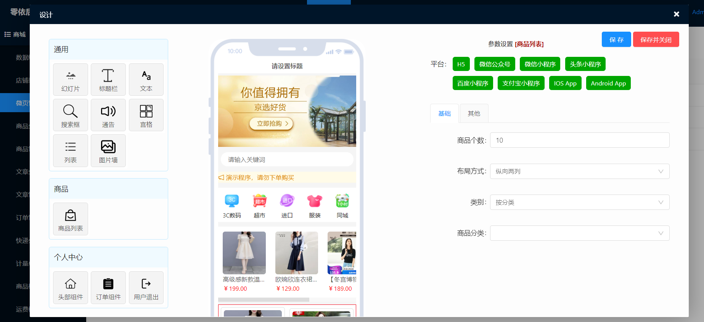
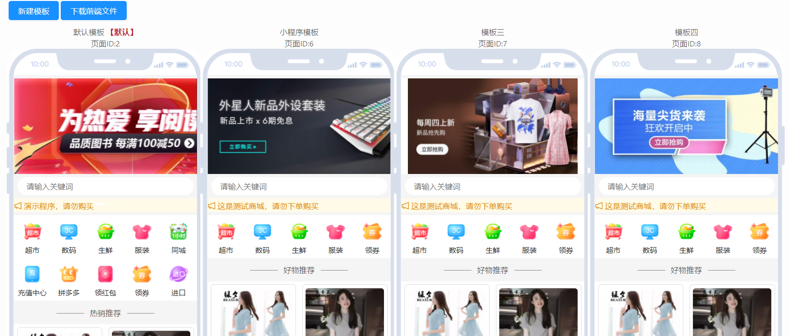
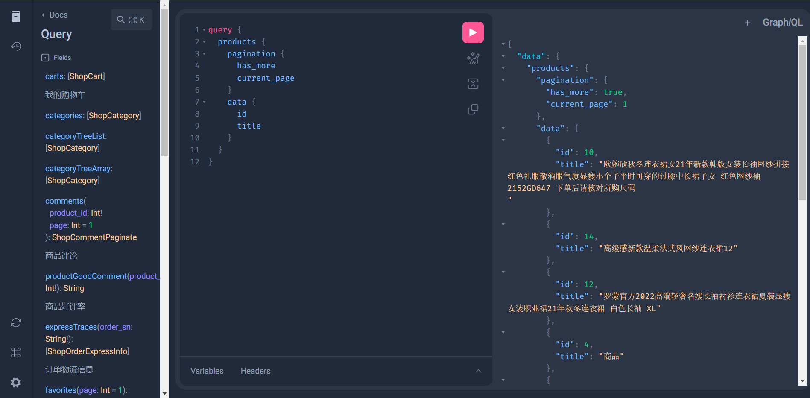

# UniApp商城

### 介绍
基于uniapp的商城系统，前端uniapp+uview，支持PC端。
后端是PHP+YiAdmin。

### 自定义装修

### 多模板
1. 每套模板的页面可以自由组合。
2. 针对不同的平台可选择不同的模板。
3. 每个页面的组件可以针对不同平台自定义是否显示。

### 基于GraphQL的Api接口
基于 [GraphQL](https://www.yiadmin.net/appstore/show/graphql.html) （快速构建PHP GraphQL服务）重构的api接口，由前端定制数据，所见即所得，接口即文档。

### 依赖
该项目依赖以下模块：
1. [GraphQL](https://www.yiadmin.net/appstore/show/graphql.html)：快速构建GraphQL服务。
2. [支付](https://www.yiadmin.net/appstore/show/pay.html): 提供支付功能。
3. [第三方登录](https://www.yiadmin.net/appstore/show/third.html): 提供第三方登录功能。
4. [富文本](https://www.yiadmin.net/appstore/show/tinymce.html): Tinymce富文本编辑器。

### 安装教程

1.  首先安装YiAdmin后台管理系统。https://gitee.com/YiAdmin/YiAdmin-Webman
2.  打包为zip文件，进入后台——模块管理离线安装即可。

项目地址：https://www.yiadmin.net/appstore/show/shop.html